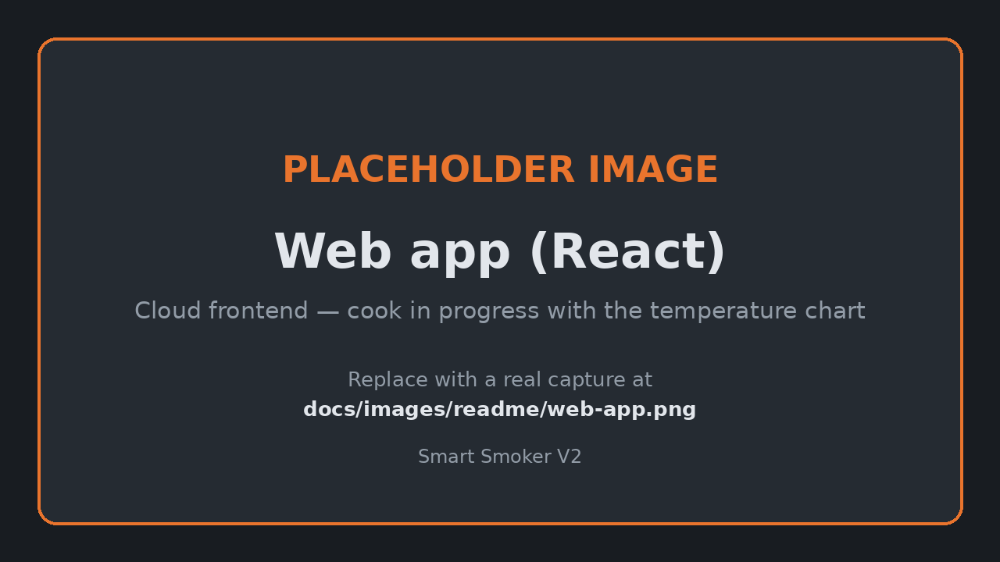
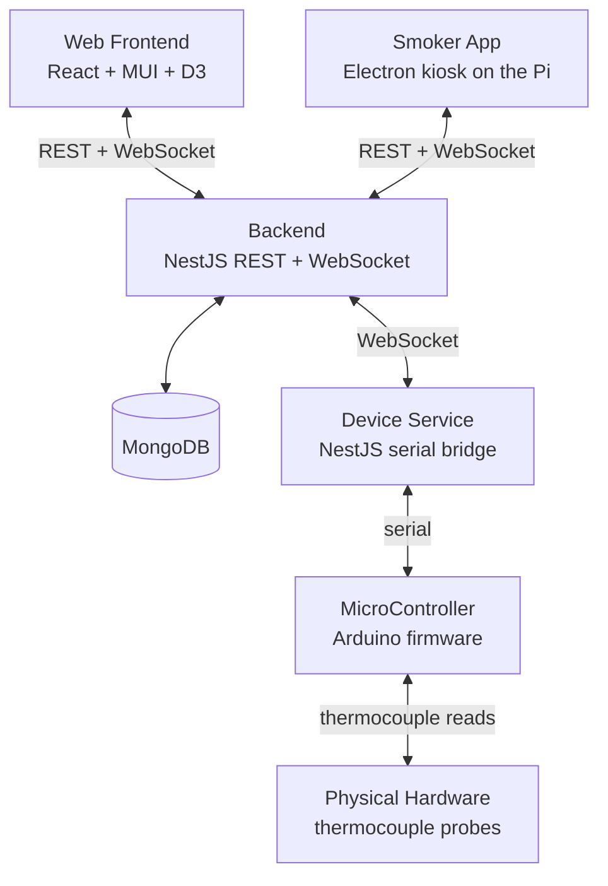
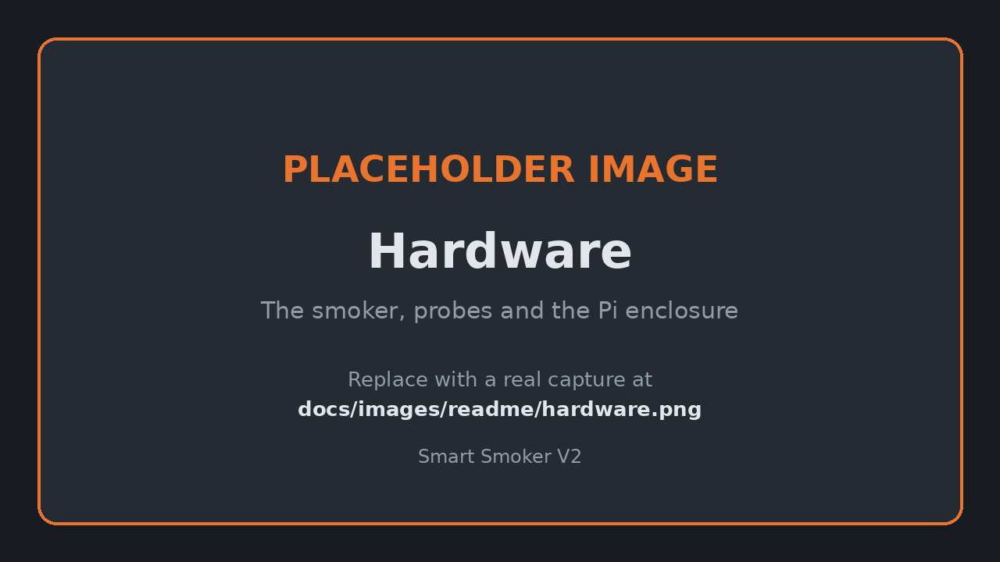

# Smart Smoker V2

Smart Smoker V2 turns a backyard smoker into a connected appliance. A
microcontroller reads four thermocouple probes — the chamber and up to three
pieces of meat — and streams them to a Raspberry Pi bolted to the pit, which
shows a live chart on a touchscreen and forwards every reading to a cloud
backend. From the couch, the phone, or anywhere else, the web app shows the same
cook in real time, predicts when the meat will be done, and pushes a
notification when a probe is closing in on its target. When the cook ends, the
whole thing — prep notes, probe traces, the events you stamped along the way,
and how it actually tasted — is filed in a searchable history so the next
brisket starts from evidence instead of memory.

## Features

- **Live cooks** — chamber and per-meat probe temperatures streamed over
  WebSockets, charted in the browser and on the pit-side touchscreen at once.
- **Done-time estimates** — an ETA per probe, blended from the current cook's
  trend and past cooks of the same meat, so you know when to wrap and when to
  eat.
- **Heads-up push notifications** — web push when a probe is within its lead
  time of target, when a cook stalls, and when the cook finishes.
- **Cook log stamps** — one tap to record "wrapped", "spritzed" or "added wood";
  each stamp lands as a marker on the temperature chart and in the cook's log.
- **Prep, profile and review** — meat, weight, rub and notes up front; wood,
  chamber target and probe targets during; rating and tasting notes after.
- **Searchable history and stats** — every finished cook kept with its full
  probe trace, plus aggregate stats across cooks.
- **Runs on the pit** — an Electron kiosk on a Raspberry Pi with a 7in
  touchscreen, with the device service beside it reading the board over the Pi's
  serial UART and Watchtower keeping both on the released images.
- **Deployed for real** — multi-arch Docker images (amd64 + arm/v7), Terraform
  and Ansible for the Proxmox host, and an automated release train.

## Architecture

Every link is two-way: commands travel down — a chamber target set in the web
app reaches the board — and temperatures travel back up the same path, from the
probes through the microcontroller's serial link to the device service, into the
backend, and out over WebSockets to both frontends at once.

## How it's built

**Monorepo.** npm workspaces, four apps and a set of shared packages:

| Path                         | What it is                                           |
| ---------------------------- | ---------------------------------------------------- |
| `apps/backend/`              | NestJS API — MongoDB/Mongoose, Socket.io, Swagger    |
| `apps/device-service/`       | NestJS microservice bridging serial/USB to the board |
| `apps/frontend/`             | React 18 + Material-UI + D3 web app                  |
| `apps/smoker/`               | Electron kiosk for the pit-side touchscreen          |
| `packages/TemperatureChart/` | Shared D3 chart used by both frontends               |
| `MicroController/`           | Arduino firmware for the probe board                 |
| `e2e/`                       | Playwright journeys against a hermetic Docker stack  |
| `infra/`                     | Terraform + Ansible for the Proxmox reference deploy |

**CI/CD.** Every PR runs Jest across all apps and packages, typechecks, builds
the frontends, and lints — with coverage thresholds enforced per app.
release-please owns versioning: conventional-commit titles accumulate into a
release PR, and merging it tags the release, publishes multi-arch Docker images
and deploys to production. A nightly job builds and deploys the dev cloud
environment off `master`.

**End-to-end testing.** A Playwright suite drives real user journeys against a
hermetic Docker stack — backend, device service, both frontends and MongoDB
brought up together — so a cook can be started, temperatures relayed and history
written before anything ships. Alongside it, a `verify-pr` harness runs the
manual verification items a PR declares, driving a headful browser and the
Electron app on a real display and posting the results back to the PR.

**Built by an agent team.** Most of this repo is written by Claude Code agents
working as a team — a lead that grooms and dispatches issues, an implementer
that works test-first, a reviewer, and a verifier that runs the smoke gate
before anything is committed. A daemon paces the whole loop against the
available model budget. To put an honest number on it: as of 2026-08-28, 216 of
the 457 commits on `master` (47%) carry an agent authorship marker in their
message — counted as commits whose body contains `Co-Authored-By: Claude` or
`Generated with [Claude Code]`, since agents commit under the maintainer's git
identity and the author field cannot tell them apart. The first such commit
landed 2025-10-05; the project itself started in 2021. Every agent-authored
change still goes through the same PR, review and CI gates as a human one.

## Docs

Full documentation — setup, per-app guides, hardware, CI/CD and infrastructure —
lives at
[benjr70.github.io/Smart-Smoker-V2](https://benjr70.github.io/Smart-Smoker-V2/).

Start with [CONTRIBUTING.md](CONTRIBUTING.md) if you want to build or run it
locally.

## License

Released under the [MIT License](LICENSE). This is a personal showcase project:
it is published so others can read it, not as a supported product.
