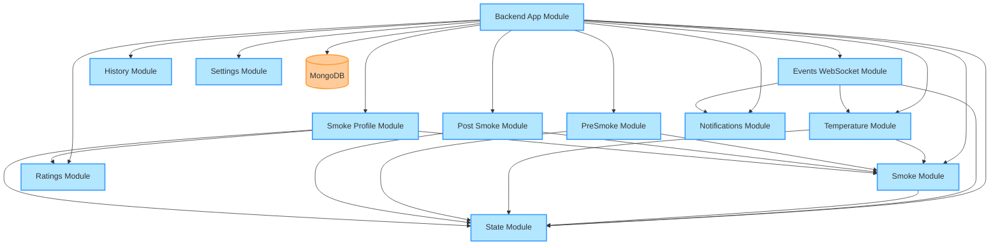
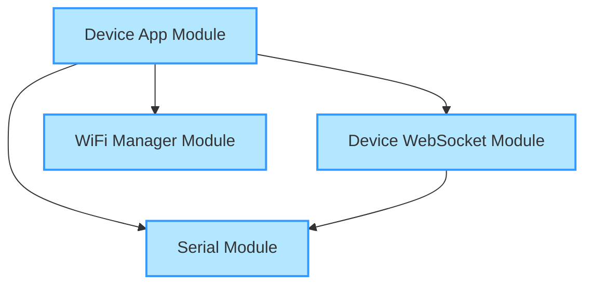
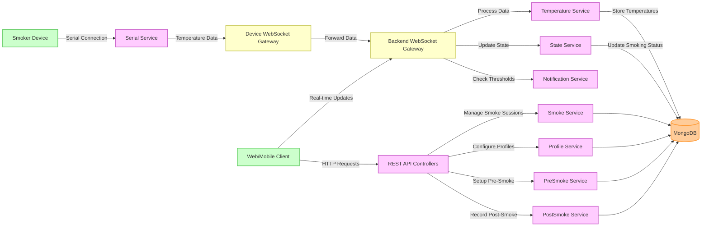

# Smart Smoker Backend Architecture

This document illustrates the architecture of the Smart Smoker backend system, showing how different modules interact with each other. The system consists of two main services:

1. **Backend Service**: Handles the business logic, database operations, and web socket communication with clients
2. **Device Service**: Manages communication with the physical smoker device through serial connection

## Backend Service Module Interaction Diagram

## Device Service Module Interaction Diagram

## System Data Flow

## Core Components

### Backend Service Components

#### State Module
- Central module for maintaining system state
- Tracks smoking status and current session information
- Many other modules depend on this for state information

#### Events Module (Backend WebSocket)
- Handles real-time communication with clients
- Receives temperature data from the device service
- Processes data and broadcasts updates to connected clients
- Relies on Temperature, State, and Notifications modules

#### Temperature Module
- Manages temperature readings
- Stores historical temperature data
- Depends on State and Smoke modules

#### Smoke Module
- Core module for smoke session management
- Depends on State module for tracking smoking status

#### PreSmoke Module
- Handles preparation phase before smoking begins
- Depends on State and Smoke modules

#### PostSmoke Module
- Manages completion phase after smoking ends
- Depends on State and Smoke modules

#### Smoke Profile Module
- Manages smoking profiles and configurations
- Depends on State, Smoke, and Ratings modules

#### Settings Module
- Handles system configuration settings
- Operates independently with its own database schema

#### Notifications Module
- Manages user notifications based on temperature thresholds
- Used by Events module to trigger notifications

#### Ratings Module
- Handles rating system for smoke profiles
- Used by Smoke Profile module

#### History Module
- Tracks historical smoking sessions
- Provides analytics and reporting capabilities

### Device Service Components

#### Serial Module
- Manages serial communication with the smoker device hardware
- Reads temperature data from temperature probes and sensors
- Exports a service that other modules can use to interact with the hardware

#### Device Events Module (Device WebSocket)
- Forwards temperature and status data from the serial module to the backend service
- Provides a WebSocket gateway for real-time communication

#### WiFi Manager Module
- Handles WiFi connectivity for the device
- Provides API for configuring WiFi settings

!!! note

    I paid $2.50 for AI to create this soooo hopefully this is right
