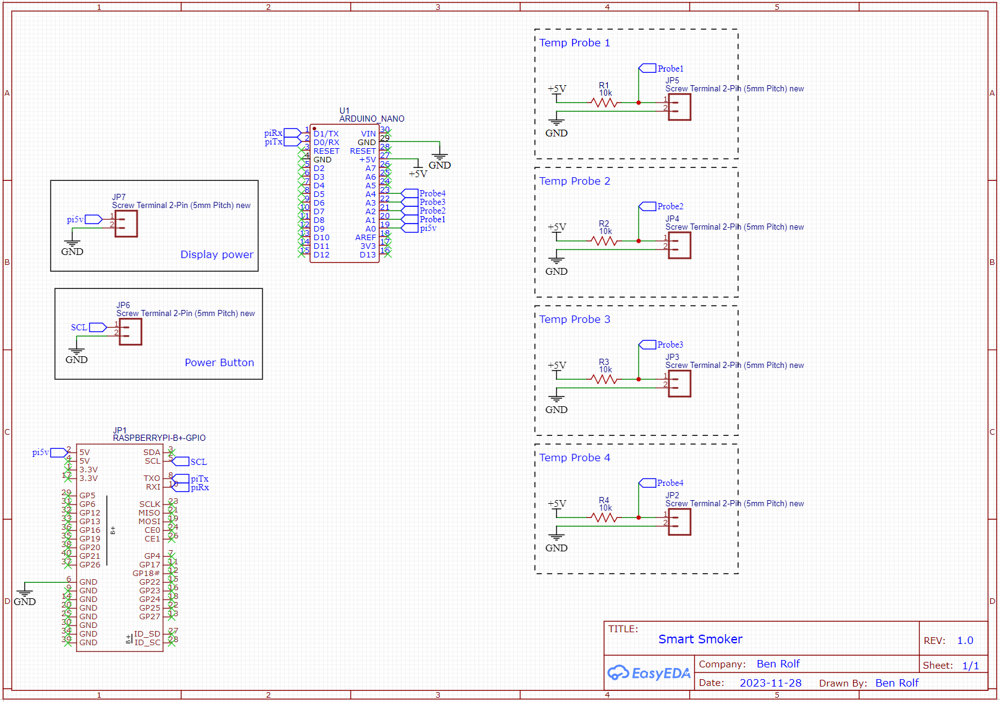
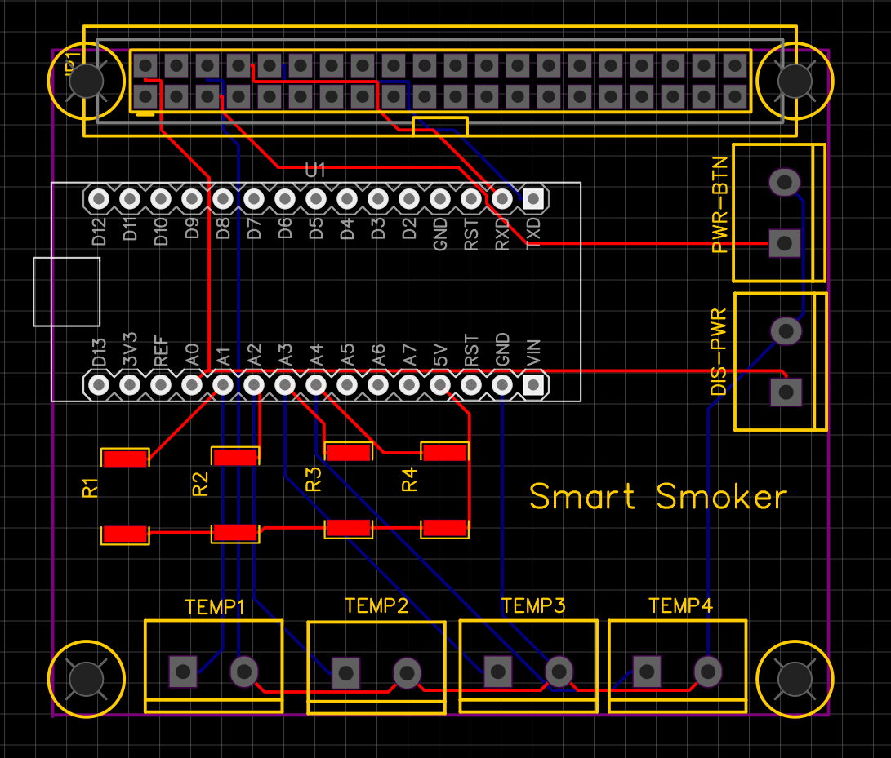

# Hardware

## Hardware list

### Smoker
 * Raspberry pi 3
 * Element 14 7" Touchscreen display
 * Arduino Nano
### Cloud Server
 * Raspberry pi 4

### Micro Controller

Breadboard diagram

PCB Schematics

PCB Diagram

