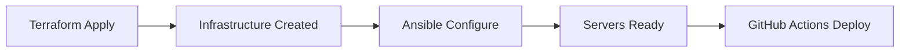

# Smart Smoker Ansible Configuration

Complete Infrastructure as Code (IaC) configuration for all Smart Smoker Proxmox infrastructure using Ansible.

## Overview

This Ansible configuration manages all server configuration for the Smart Smoker project:
- **GitHub Actions Runner** - Self-hosted CI/CD runner
- **Development Cloud** - Development environment for cloud applications
- **Production Cloud** - Production environment for cloud applications
- **Virtual Smoker Device** - Virtual test device for development

## Prerequisites

### Control Machine (Your Local Machine)

```bash
# Install Ansible
pip3 install ansible

# Install required Ansible collections
ansible-galaxy collection install community.general
ansible-galaxy collection install ansible.posix
```

### Proxmox Infrastructure

Ensure all infrastructure is provisioned via Terraform (Phase 2 Story 1) before running Ansible.

## Quick Start

### 1. Configure Inventory

Update `inventory/hosts.yml` with your server IP addresses (if different from Terraform defaults):

```yaml
all:
  children:
    runners:
      hosts:
        github-runner:
          ansible_host: 10.20.0.10
```

### 2. Configure Variables

Edit group variables in `inventory/group_vars/`:
- `all.yml` - Common settings (SSH keys, DNS, firewall)
- `runners.yml` - GitHub runner settings
- `cloud_servers.yml` - Cloud application settings
- `devices.yml` - Device-specific settings

### 3. Add SSH Keys

Update `inventory/group_vars/all.yml` with your SSH public keys:

```yaml
ssh_public_keys:
  - "ssh-ed25519 AAAA... your-key-here"
```

### 4. Run Playbooks

#### Configure All Infrastructure
```bash
ansible-playbook playbooks/site.yml
```

#### Configure Individual Servers
```bash
# GitHub Runner (requires token)
ansible-playbook playbooks/setup-github-runner.yml \
  --extra-vars "github_runner_token=YOUR_GITHUB_TOKEN"

# Development Cloud
ansible-playbook playbooks/setup-dev-cloud.yml

# Production Cloud (requires confirmation)
ansible-playbook playbooks/setup-prod-cloud.yml

# Virtual Smoker Device
ansible-playbook playbooks/setup-virtual-smoker.yml
```

#### Verify Configuration
```bash
ansible-playbook playbooks/verify-all.yml
```

## Architecture

### Roles

| Role | Purpose | Applied To |
|------|---------|------------|
| `common` | Base system hardening, SSH, firewall, fail2ban | All servers |
| `docker` | Docker Engine + Docker Compose | All servers |
| `terraform` | Terraform CLI installation | GitHub Runner |
| `nodejs` | Node.js 20 LTS runtime | GitHub Runner, Cloud Servers |
| `github-runner` | GitHub Actions self-hosted runner | GitHub Runner |
| `cloud-app` | Cloud application dependencies | Cloud Servers |
| `virtual-device` | Virtual device dependencies | Virtual Devices |

### Playbooks

- `site.yml` - Master playbook (runs all)
- `setup-github-runner.yml` - Configure GitHub Actions runner
- `setup-dev-cloud.yml` - Configure development cloud
- `setup-prod-cloud.yml` - Configure production cloud
- `setup-virtual-smoker.yml` - Configure virtual device
- `verify-all.yml` - Verify all configurations

## GitHub Runner Setup

### Generate Runner Token

1. Go to: `https://github.com/benjr70/Smart-Smoker-V2/settings/actions/runners/new`
2. Copy the registration token
3. Run playbook with token:

```bash
ansible-playbook playbooks/setup-github-runner.yml \
  --extra-vars "github_runner_token=YOUR_TOKEN_HERE"
```

### Verify Runner

```bash
# Check runner status
ssh root@10.20.0.10
sudo -u runner /home/runner/actions-runner/run.sh --check

# View runner logs
sudo journalctl -u actions.runner.* -f
```

## Security Features

### SSH Hardening
- Key-based authentication only (password auth disabled)
- Root login with public key only
- Custom SSH port support
- Connection rate limiting

### Firewall (UFW)
- Default deny incoming
- Default allow outgoing
- Host-specific rules per server type
- Network isolation for virtual devices

### Fail2ban
- SSH brute force protection
- Configurable ban times and retry limits
- Automatic IP blocking

## Common Tasks

### Update All Servers
```bash
ansible-playbook playbooks/site.yml --tags update
```

### Check Connectivity
```bash
ansible all -m ping
```

### Run Ad-hoc Commands
```bash
# Check Docker status on all hosts
ansible all -m command -a "docker --version"

# Check disk space
ansible all -m command -a "df -h"

# Restart Docker on cloud servers
ansible cloud_servers -m service -a "name=docker state=restarted" --become
```

### Update SSH Keys
```bash
# Edit inventory/group_vars/all.yml
# Then run:
ansible-playbook playbooks/site.yml --tags ssh
```

## Troubleshooting

### Connection Issues

```bash
# Test SSH connection
ssh -i ~/.ssh/id_ed25519 root@10.20.0.10

# Verbose Ansible output
ansible-playbook playbooks/site.yml -vvv
```

### Runner Registration Fails

```bash
# Manually register runner
ssh root@10.20.0.10
sudo -u runner /home/runner/actions-runner/config.sh \
  --url https://github.com/benjr70/Smart-Smoker-V2 \
  --token YOUR_TOKEN
```

### UFW Blocks Ansible

If you get locked out, access via Proxmox console:
```bash
ufw allow 22/tcp
ufw reload
```

## Variables Reference

### Common Variables (`group_vars/all.yml`)

| Variable | Default | Description |
|----------|---------|-------------|
| `ssh_port` | `22` | SSH port |
| `ssh_permit_root_login` | `prohibit-password` | Root login policy |
| `ssh_password_authentication` | `false` | Password auth |
| `timezone` | `America/New_York` | System timezone |
| `fail2ban_enabled` | `true` | Enable fail2ban |
| `fail2ban_ban_time` | `3600` | Ban duration (seconds) |
| `docker_compose_version` | `2.24.0` | Docker Compose version |
| `nodejs_version` | `20` | Node.js major version |

### GitHub Runner Variables (`group_vars/runners.yml`)

| Variable | Default | Description |
|----------|---------|-------------|
| `github_runner_user` | `runner` | Runner system user |
| `github_runner_home` | `/home/runner` | Runner home directory |
| `github_repository` | `benjr70/Smart-Smoker-V2` | GitHub repository |
| `github_runner_labels` | `[self-hosted, linux, x64, proxmox]` | Runner labels |

### Cloud Server Variables (`group_vars/cloud_servers.yml`)

| Variable | Default | Description |
|----------|---------|-------------|
| `app_base_dir` | `/opt/smart-smoker` | Application directory |
| `app_user` | `smoker` | Application user |
| `mongodb_data_dir` | `/opt/smart-smoker/data/mongodb` | MongoDB data |
| `mongodb_version` | `4.4` | MongoDB version |

## Integration with Terraform

This Ansible configuration complements the Terraform infrastructure:

1. **Terraform** - Provisions infrastructure (VMs, containers, networking)
2. **Ansible** - Configures servers (software, security, services)
3. **Docker Compose** - Deploys applications (via GitHub Actions)

### Workflow



## CI/CD Integration

Ansible validation is automated via GitHub Actions:
- Runs on every push to `infra/proxmox/ansible/`
- Validates syntax with `ansible-lint`
- Checks playbook syntax
- Validates role dependencies

## Best Practices

1. **Always test in dev first** - Run playbooks on dev-cloud before prod-cloud
2. **Use check mode** - Test changes with `--check` flag
3. **Limit execution** - Use `--limit` to target specific hosts
4. **Version control** - All changes committed to git
5. **Idempotent playbooks** - Safe to run multiple times
6. **Secrets management** - Use Ansible Vault for sensitive data

## Next Steps

After Ansible configuration:

1. ✅ Infrastructure provisioned (Terraform)
2. ✅ Servers configured (Ansible)
3. ⏭️ Configure Tailscale mesh network (Phase 2 Story 3)
4. ⏭️ Deploy applications via GitHub Actions
5. ⏭️ Migrate production database

## Support

For issues or questions:
- Check playbook output for specific error messages
- Review Ansible logs: `/var/log/ansible.log`
- Consult Ansible documentation: https://docs.ansible.com
- Open GitHub issue: https://github.com/benjr70/Smart-Smoker-V2/issues
