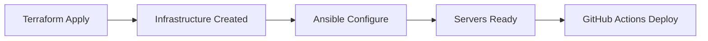

# Smart Smoker Ansible Configuration

Complete Infrastructure as Code (IaC) configuration for all Smart Smoker Proxmox infrastructure using Ansible.

## Overview

This Ansible configuration manages all server configuration for the Smart Smoker project:
- **GitHub Actions Runner** - Self-hosted CI/CD runner
- **Development Cloud** - Development environment for cloud applications
- **Production Cloud** - Production environment for cloud applications
- **Virtual Smoker Device** - Virtual test device for development

> **Note on virtual-smoker arm/v7 emulation**: `dev-deploy.yml` self-heals the
> qemu/binfmt prereq when targeting `virtual-smoker` (via the
> `requires_arm_emulation: true` input on the `device-deploy.yml` reusable
> workflow), installing `qemu-user-static` + `binfmt-support` and registering
> `qemu-arm` if missing. This is a deploy-time guard — a strict subset of the
> Ansible `virtual-device` role, which remains canonical for fresh
> provisioning and runbook procedures.

## Prerequisites

### Control Machine (Your Local Machine)

```bash
# Install Ansible
pip3 install ansible

# Install required Ansible collections
ansible-galaxy collection install community.general
ansible-galaxy collection install ansible.posix
```

### Proxmox Infrastructure

Ensure all infrastructure is provisioned via Terraform (Phase 2 Story 1) before running Ansible.

## Quick Start

### Repo variables (single source of truth for hostnames)

Hostnames live in **GitHub Actions repository variables** (Settings → Secrets and
variables → Actions → Variables). The Ansible inventory must agree with these
values so a re-provision can rename the peer without breaking deploys
(issue #189):

| Variable            | Example value                                  | Consumed by                                                                |
| ------------------- | ---------------------------------------------- | -------------------------------------------------------------------------- |
| `DEV_CLOUD_HOST`    | `smoker-dev-cloud-1`                           | `dev-deploy.yml`, this inventory's `dev_cloud` key + `ansible_host`        |
| `DEV_CLOUD_FQDN`    | `smoker-dev-cloud-1.tail74646.ts.net`          | `publish.yml` (`REACT_APP_CLOUD_URL` for nightly smoker builds)            |
| `DEVICE_HOST`       | `virtual-smoker`                               | `device-deploy.yml`, this inventory's `virtual-smoker-device` group        |
| `CLOUD_BACKEND_URL` | `https://smoker-dev-cloud-1.tail74646.ts.net:8443` | `dev-deploy.yml`, `device-deploy.yml`, `scripts/device-health-check.sh` |

The runtime fallback is `scripts/smoke/resolve-host.ts` (issue #187), which
resolves a short name to the canonical Tailscale FQDN by walking
`tailscale status --json`. It tolerates numeric suffix drift after a
re-provision (e.g. peer `-1` becomes `-2`) and is invoked transparently by
`scripts/deployment-health-check.sh`.

The inventory key in `inventory/hosts.yml` (`smart-smoker-dev-cloud-1`) and the
host_vars filename (`smart-smoker-dev-cloud-1.yml`) must match the same `-1`
hostname so Ansible host_vars autodiscovery works.

### 1. Configure Inventory

Update `inventory/hosts.yml` with your server IP addresses (if different from Terraform defaults):

```yaml
all:
  children:
    runners:
      hosts:
        github-runner:
          ansible_host: 10.20.0.10
```

### 2. Configure Variables

Edit group variables in `inventory/group_vars/`:
- `all.yml` - Common settings (SSH keys, DNS, firewall)
- `runners.yml` - GitHub runner settings
- `cloud_servers.yml` - Cloud application settings
- `devices.yml` - Device-specific settings

### 3. Provide SSH Keys

**IMPORTANT**: Do NOT commit SSH keys to the repository!

Pass SSH keys via command line:

```bash
# Option 1: Pass keys directly
ansible-playbook playbooks/site.yml \
  --extra-vars "ssh_public_keys=['ssh-ed25519 AAAA... user@example.com']"

# Option 2: Load from your local authorized_keys file
ansible-playbook playbooks/site.yml \
  --extra-vars "ssh_public_keys=$(cat ~/.ssh/id_ed25519.pub | jq -R -s -c 'split(\"\n\") | map(select(length > 0))')"

# Option 3: For your current setup (temporary)
ansible-playbook playbooks/site.yml \
  --extra-vars "ssh_public_keys=['ssh-ed25519 AAAAC3NzaC1lZDI1NTE5AAAAIGVL60IcGPlVOKMXK9xuLWLBVmCu8HCQ/mN8LZ8gSFN4 benrolf70@gmail.com']"
```

### 4. Run Playbooks

#### Configure All Infrastructure
```bash
ansible-playbook playbooks/site.yml
```

#### Configure Individual Servers
```bash
# GitHub Runner (requires token)
ansible-playbook playbooks/setup-github-runner.yml \
  --extra-vars "github_runner_token=YOUR_GITHUB_TOKEN"

# Development Cloud
ansible-playbook playbooks/setup-dev-cloud.yml

# Production Cloud (requires confirmation)
ansible-playbook playbooks/setup-prod-cloud.yml

# Virtual Smoker Device
ansible-playbook playbooks/setup-virtual-smoker.yml
```

#### Verify Configuration
```bash
ansible-playbook playbooks/verify-all.yml
```

## Architecture

### Roles

| Role | Purpose | Applied To |
|------|---------|------------|
| `common` | Base system hardening, SSH, firewall, fail2ban | All servers |
| `docker` | Docker Engine + Docker Compose | All servers |
| `terraform` | Terraform CLI installation | GitHub Runner |
| `nodejs` | Node.js 20 LTS runtime | GitHub Runner, Cloud Servers |
| `github-runner` | GitHub Actions self-hosted runner | GitHub Runner |
| `cloud-app` | Cloud application dependencies | Cloud Servers |
| `virtual-device` | Virtual device dependencies | Virtual Devices |
| `tailscale` | Tailscale VPN mesh network with Serve/Funnel | All servers |

### Playbooks

- `site.yml` - Master playbook (runs all)
- `setup-github-runner.yml` - Configure GitHub Actions runner
- `setup-dev-cloud.yml` - Configure development cloud
- `setup-prod-cloud.yml` - Configure production cloud
- `setup-virtual-smoker.yml` - Configure virtual device
- `verify-all.yml` - Verify all configurations
- `verify-tailscale.yml` - Verify Tailscale mesh network

## Tailscale Mesh Network

All infrastructure is connected via Tailscale VPN, creating a secure mesh network for internal communication and enabling public access to production services via Tailscale Funnel.

### Network Topology

```
Tailscale Mesh Network
├─ smoker-runner (GitHub Actions runner)
│  └─ Tags: runner, ci-cd
├─ smoker-dev-cloud-1 (Development environment)
│  ├─ Tags: server, development
│  └─ Serve: HTTP (80), WebSocket (3001) - Tailnet only
├─ smokecloud (Production environment)
│  ├─ Tags: server, production
│  └─ Funnel: HTTPS (443→80), HTTPS (8443→3001) - Public access
└─ virtual-smoker (Virtual test device)
   └─ Tags: device, virtual
```

### Prerequisites

1. **Create Tailscale Account**: https://login.tailscale.com/start
2. **Generate Auth Key**: https://login.tailscale.com/admin/settings/keys
   - Enable "Reusable" for infrastructure automation
   - Set expiration to "90 days" or longer
   - Add tags if using ACLs: `tag:server`, `tag:runner`, `tag:device`, `tag:production`, `tag:development`

### Tailscale Admin DNS Configuration (Required)

Before running any playbook, configure global nameservers in the Tailscale admin console:

1. Go to <https://login.tailscale.com/admin/dns>
2. Under **Global nameservers**, add:
   - `1.1.1.1` (Cloudflare)
   - `8.8.8.8` (Google)
3. Ensure **Override local DNS** is enabled so `accept-dns=true` forwards unknown queries upstream

**Why this is mandatory for Proxmox LXCs**: `chattr +i /etc/resolv.conf` is blocked
inside unprivileged LXC containers, so DNS cannot be locked in-container. Without
global nameservers set in the admin console, Docker image pulls (`registry-1.docker.io`)
and other public DNS queries will break after `tailscaled` restarts or LXC reboots.

The tailscale Ansible role asserts this is configured (`tailscale dns status` must
show at least one resolver). The playbook will fail with an actionable error message
if the admin console DNS is not set up.

### Setup Tailscale Network

#### Option 1: Configure with Ansible (Recommended)

Pass the Tailscale auth key when running playbooks:

```bash
# Configure all infrastructure with Tailscale
ansible-playbook playbooks/site.yml \
  --extra-vars "tailscale_auth_key=tskey-auth-XXXXX"

# Configure individual servers
ansible-playbook playbooks/setup-github-runner.yml \
  --extra-vars "github_runner_token=YOUR_GITHUB_TOKEN tailscale_auth_key=tskey-auth-XXXXX"

ansible-playbook playbooks/setup-dev-cloud.yml \
  --extra-vars "tailscale_auth_key=tskey-auth-XXXXX"

ansible-playbook playbooks/setup-prod-cloud.yml \
  --extra-vars "tailscale_auth_key=tskey-auth-XXXXX"

ansible-playbook playbooks/setup-virtual-smoker.yml \
  --extra-vars "tailscale_auth_key=tskey-auth-XXXXX"
```

#### Option 2: Manual Configuration

If Ansible runs without an auth key, Tailscale will be installed but not connected. Connect manually:

```bash
# SSH to each server
ssh root@<server-ip>

# Connect to Tailscale network
tailscale up --hostname=<hostname>

# Follow the authentication URL in your browser
```

### Tailscale Configuration

#### Development Environment (Tailscale Serve)

The dev environment exposes services on the Tailscale network only (not publicly accessible):

```bash
# Services accessible on tailnet
http://smoker-dev-cloud-1        # Main HTTP service (port 80)
http://smoker-dev-cloud-1:3001   # WebSocket service (port 3001)
```

#### Production Environment (Tailscale Funnel)

Production services are publicly accessible via HTTPS using Tailscale Funnel:

```bash
# Public URLs (accessible from anywhere on the internet)
https://smokecloud.tail74646.ts.net        # Main HTTPS endpoint
https://smokecloud.tail74646.ts.net:8443   # WebSocket endpoint
```

**Note**: The public domain suffix (`tail74646.ts.net`) is unique to your Tailscale account. Check your actual domain:

```bash
ssh root@smokecloud
tailscale funnel status
```

### Verify Tailscale Configuration

#### Automated Verification

```bash
# Run Tailscale verification playbook
ansible-playbook playbooks/verify-tailscale.yml

# Run comprehensive mesh network tests
../scripts/test-tailscale-mesh.sh
```

#### Manual Verification

```bash
# Check status on each host
ssh root@<host>
tailscale status

# Get Tailscale IP
tailscale ip -4

# Check serve/funnel configuration
tailscale serve status
tailscale funnel status  # Production only
```

### Testing Connectivity

```bash
# From any machine on the Tailscale network
ping smoker-runner
ping smoker-dev-cloud-1
ping smokecloud
ping virtual-smoker

# Test HTTP endpoints (from tailnet)
curl http://smoker-dev-cloud-1
curl http://smokecloud

# Test public endpoints (from anywhere)
curl https://smokecloud.tail74646.ts.net
```

### Reconfigure Tailscale Serve/Funnel

If you need to reconfigure Tailscale Serve or Funnel after initial setup:

```bash
# Production: Run the generated configuration script
ssh root@smokecloud
/usr/local/bin/configure-tailscale-funnel.sh

# Or re-run the Ansible playbook
ansible-playbook playbooks/setup-prod-cloud.yml \
  --extra-vars "tailscale_auth_key=tskey-auth-XXXXX"
```

### Tailscale Security

- **Firewall Integration**: UFW automatically allows Tailscale interface and port 41641/UDP
- **SSH Over Tailscale**: Optional (disabled by default). Enable with `tailscale_ssh_enabled: true`
- **Access Control**: Use Tailscale ACLs to restrict access between nodes
- **Tagging**: Hosts are tagged for ACL-based access control

### Troubleshooting Tailscale

#### Tailscale Not Connected

```bash
# Check service status
systemctl status tailscaled

# Check logs
journalctl -u tailscaled -f

# Reconnect manually
tailscale up --authkey=tskey-auth-XXXXX --hostname=<hostname>
```

#### Cannot Reach Other Nodes

```bash
# Check Tailscale status
tailscale status

# Verify UFW allows Tailscale
ufw status | grep tailscale

# Check routes
tailscale status --json | jq '.Peer'
```

#### Funnel Not Working

```bash
# Check funnel status on production
ssh root@smokecloud
tailscale funnel status

# Verify serve is configured first
tailscale serve status

# Reconfigure funnel
/usr/local/bin/configure-tailscale-funnel.sh
```

#### Reset Tailscale Configuration

```bash
# Reset serve/funnel configuration
tailscale serve reset

# Disconnect from network
tailscale down

# Reconnect
tailscale up --authkey=tskey-auth-XXXXX --hostname=<hostname>
```

### Tailscale Variables Reference

| Variable | Default | Description |
|----------|---------|-------------|
| `tailscale_auth_key` | `""` | Tailscale authentication key (required) |
| `tailscale_hostname` | `{{ inventory_hostname }}` | Hostname on Tailscale network |
| `tailscale_tags` | `[]` | Tailscale tags for ACLs |
| `tailscale_ssh_enabled` | `false` | Enable Tailscale SSH |
| `tailscale_accept_routes` | `true` | Accept subnet routes from other nodes |
| `tailscale_accept_dns` | `true` | Accept DNS settings from Tailscale |
| `tailscale_serve_enabled` | `false` | Enable Tailscale Serve (tailnet only) |
| `tailscale_serve_config` | `[]` | List of ports to serve |
| `tailscale_funnel_enabled` | `false` | Enable Tailscale Funnel (public access) |
| `tailscale_funnel_config` | `[]` | List of ports to expose publicly |

## GitHub Runner Setup

### Generate Runner Token

1. Go to: `https://github.com/benjr70/Smart-Smoker-V2/settings/actions/runners/new`
2. Copy the registration token
3. Run playbook with token:

```bash
ansible-playbook playbooks/setup-github-runner.yml \
  --extra-vars "github_runner_token=YOUR_TOKEN_HERE"
```

### Verify Runner

```bash
# Check runner status
ssh root@10.20.0.10
sudo -u runner /home/runner/actions-runner/run.sh --check

# View runner logs
sudo journalctl -u actions.runner.* -f
```

## Security Features

### SSH Hardening
- Key-based authentication only (password auth disabled)
- Root login with public key only
- Custom SSH port support
- Connection rate limiting

### Firewall (UFW)
- Default deny incoming
- Default allow outgoing
- Host-specific rules per server type
- Network isolation for virtual devices

### Fail2ban
- SSH brute force protection
- Configurable ban times and retry limits
- Automatic IP blocking

## Common Tasks

### Update All Servers
```bash
ansible-playbook playbooks/site.yml --tags update
```

### Check Connectivity
```bash
ansible all -m ping
```

### Run Ad-hoc Commands
```bash
# Check Docker status on all hosts
ansible all -m command -a "docker --version"

# Check disk space
ansible all -m command -a "df -h"

# Restart Docker on cloud servers
ansible cloud_servers -m service -a "name=docker state=restarted" --become
```

### Update SSH Keys
```bash
# Edit inventory/group_vars/all.yml
# Then run:
ansible-playbook playbooks/site.yml --tags ssh
```

## Troubleshooting

### Connection Issues

```bash
# Test SSH connection
ssh -i ~/.ssh/id_ed25519 root@10.20.0.10

# Verbose Ansible output
ansible-playbook playbooks/site.yml -vvv
```

### Runner Registration Fails

```bash
# Manually register runner
ssh root@10.20.0.10
sudo -u runner /home/runner/actions-runner/config.sh \
  --url https://github.com/benjr70/Smart-Smoker-V2 \
  --token YOUR_TOKEN
```

### UFW Blocks Ansible

If you get locked out, access via Proxmox console:
```bash
ufw allow 22/tcp
ufw reload
```

## Variables Reference

### Common Variables (`group_vars/all.yml`)

| Variable | Default | Description |
|----------|---------|-------------|
| `ssh_port` | `22` | SSH port |
| `ssh_permit_root_login` | `prohibit-password` | Root login policy |
| `ssh_password_authentication` | `false` | Password auth |
| `timezone` | `America/New_York` | System timezone |
| `fail2ban_enabled` | `true` | Enable fail2ban |
| `fail2ban_ban_time` | `3600` | Ban duration (seconds) |
| `docker_compose_version` | `2.24.0` | Docker Compose version |
| `nodejs_version` | `20` | Node.js major version |

### GitHub Runner Variables (`group_vars/runners.yml`)

| Variable | Default | Description |
|----------|---------|-------------|
| `github_runner_user` | `runner` | Runner system user |
| `github_runner_home` | `/home/runner` | Runner home directory |
| `github_repository` | `benjr70/Smart-Smoker-V2` | GitHub repository |
| `github_runner_labels` | `[self-hosted, linux, x64, proxmox]` | Runner labels |

### Cloud Server Variables (`group_vars/cloud_servers.yml`)

| Variable | Default | Description |
|----------|---------|-------------|
| `app_base_dir` | `/opt/smart-smoker` | Application directory |
| `app_user` | `smoker` | Application user |
| `mongodb_data_dir` | `/opt/smart-smoker/data/mongodb` | MongoDB data |
| `mongodb_version` | `4.4` | MongoDB version |

## Integration with Terraform

This Ansible configuration complements the Terraform infrastructure:

1. **Terraform** - Provisions infrastructure (VMs, containers, networking)
2. **Ansible** - Configures servers (software, security, services)
3. **Docker Compose** - Deploys applications (via GitHub Actions)

### Workflow


```mermaid
graph LR
    A[Terraform Apply] --> B[Infrastructure Created]
    B --> C[Ansible Configure]
    C --> D[Servers Ready]
    D --> E[GitHub Actions Deploy]
```

## CI/CD Integration

Ansible validation is automated via GitHub Actions:
- Runs on every push to `infra/proxmox/ansible/`
- Validates syntax with `ansible-lint`
- Checks playbook syntax
- Validates role dependencies

## Best Practices

1. **Always test in dev first** - Run playbooks on dev-cloud before prod-cloud
2. **Use check mode** - Test changes with `--check` flag
3. **Limit execution** - Use `--limit` to target specific hosts
4. **Version control** - All changes committed to git
5. **Idempotent playbooks** - Safe to run multiple times
6. **Secrets management** - Use Ansible Vault for sensitive data

## Next Steps

After Ansible configuration:

1. ✅ Infrastructure provisioned (Terraform)
2. ✅ Servers configured (Ansible)
3. ✅ Tailscale mesh network configured (Phase 2 Story 3)
4. ⏭️ Deploy applications via GitHub Actions
5. ⏭️ Migrate production database

## Self-Healing: DNS Guardrail

The `github-runner` role deploys a DNS guardrail that blocks the runner service
from starting when DNS is broken, and repairs it automatically.

**How it works:**

1. A drop-in `dns-guard.conf` is installed under the runner's systemd service
   drop-in directory (e.g. `actions.runner.<name>.service.d/`). It adds
   `ExecStartPre=/usr/local/bin/runner-dns-guard.sh`.
2. On every start attempt, `runner-dns-guard.sh` probes
   `pipelinesghubeus5.actions.githubusercontent.com` via `getent hosts`.
3. If the probe fails, it restarts `tailscaled`, rewrites `/etc/resolv.conf`
   from `/etc/resolv.conf.template` (1.1.1.1 + 8.8.8.8), then re-checks.
4. If DNS is still broken, the script exits non-zero and the runner service
   does not start.
5. A `runner-dns-guard.timer` also runs the script every 10 minutes
   independently, so DNS is repaired even if the runner is not actively
   restarting.

**Key files:**
- `/usr/local/bin/runner-dns-guard.sh` — probe + remediation script
- `/etc/resolv.conf.template` — known-good nameservers (1.1.1.1, 8.8.8.8, 8.8.4.4)
- `/var/log/runner-dns-guard.log` — guard log

## Self-Healing: Re-registration Watchdog

When a GitHub Actions runner's registration is revoked (e.g. after a long
offline period), the runner log contains "registration deleted from server".
The watchdog detects this and re-registers automatically using a stored PAT.

**How it works:**

1. A systemd path unit `runner-reregister-watchdog.path` monitors
   `<install_dir>/_diag/` for changes (new log files written by the runner).
2. When the path changes, `runner-reregister-watchdog.service` fires.
3. `runner-reregister-watchdog.sh` checks the latest `Runner_*.log` for
   "registration deleted from server".
4. If found, it reads the PAT from `/etc/actions-runner/.token`, POSTs to
   `https://api.github.com/repos/<repo>/actions/runners/registration-token`
   to get a fresh token, then runs `./config.sh --replace`.
5. The runner service is restarted automatically.

**Key files:**
- `/usr/local/bin/runner-reregister-watchdog.sh` — watchdog script
- `/etc/actions-runner/.token` — PAT file (mode 0600, owned by runner user)
- `/var/log/runner-reregister-watchdog.log` — watchdog log

## PAT Rotation Procedure

The GitHub PAT stored at `/etc/actions-runner/.token` grants the runner the
ability to generate fresh registration tokens. It must be rotated when it
expires or is compromised.

**Storage:**
- Path: `/etc/actions-runner/.token`
- Mode: `0600`
- Owner: `{{ github_runner_user }}` (default: `runner`)

**Rotation steps:**
1. Generate a new PAT in GitHub → Settings → Developer settings → Personal
   access tokens. Required scope: `repo` (for `actions/runners` API).
2. Update the secret in your inventory/vault:
   ```
   github_runner_pat: "<new-pat>"
   ```
3. Re-run the playbook with the `self-healing` tag:
   ```bash
   ansible-playbook playbooks/github-runner.yml --tags self-healing -e "github_runner_pat=<new-pat>"
   ```
   This overwrites `/etc/actions-runner/.token` with mode 0600 (`no_log: true`).
4. Verify the file on the runner host:
   ```bash
   ssh root@<runner-host> "ls -la /etc/actions-runner/.token && wc -c /etc/actions-runner/.token"
   ```
5. Revoke the old PAT in GitHub settings.

**Note:** The file `/etc/github-runner/pat` (used by the older
`runner-health-check.sh`) is a separate artifact. If both self-healing
mechanisms are active, rotate both files.

## Zombie Service Cleanup Runbook

If the runner fails to re-register or the role re-apply fails with "unit
already loaded", stale systemd service files from old runner registrations
may be present. The role cleans these up idempotently on every run.

**Known zombie service names:**
- `smart-smoker-runner-1.service`
- `smoker-runner-1.service`

**Known blocker:**
- `.runner_migrated` marker in the runner install directory blocks `./svc.sh
  install` from creating a new service. The role removes it automatically.

**Manual cleanup (if role re-apply is not possible):**
```bash
systemctl stop smart-smoker-runner-1.service smoker-runner-1.service 2>/dev/null || true
rm -f /etc/systemd/system/smart-smoker-runner-1.service
rm -f /etc/systemd/system/smoker-runner-1.service
rm -f <install_dir>/.runner_migrated
systemctl daemon-reload
```

## Support

For issues or questions:
- Check playbook output for specific error messages
- Review Ansible logs: `/var/log/ansible.log`
- Consult Ansible documentation: https://docs.ansible.com
- Open GitHub issue: https://github.com/benjr70/Smart-Smoker-V2/issues
